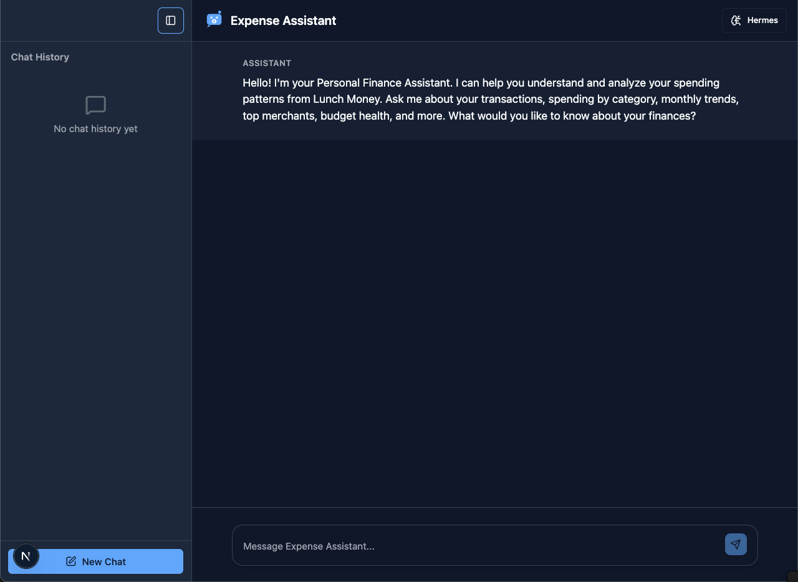
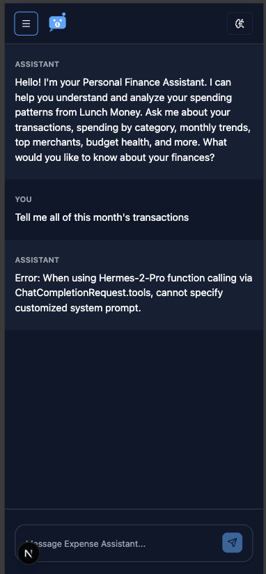

# LM Expense Tracker

An AI-powered personal finance assistant that analyzes spending patterns from Lunch Money. Runs entirely in your browser using WebLLM for complete privacy - no data leaves your device.

## Features

- **On-Device AI**: WebLLM-powered chatbot with WebGPU acceleration
- **Function Calling**: LLM automatically calls tools to retrieve and analyze financial data
- **Lunch Money Integration**: Connect to your Lunch Money account for real transaction analysis
- **Transaction Caching**: Smart caching minimizes API calls and improves performance
- **Chat History**: Persistent conversation history with localStorage
- **PWA Support**: Install as a Progressive Web App on any device
- **Dark Mode**: Responsive design with light/dark theme support

## Screenshots

Web


Mobile


### Usage

Monthly Overview:
"Summarize my spending for the last month, broken down by category, and highlight the top 3 areas where I spent the most."

Trends Over Time:
"Compare my monthly spending over the last 6 months and tell me which categories are increasing or decreasing."

Budget Analysis:
"Based on my current spending patterns, which categories should I cut back on to stay within a $3,000 monthly budget?"

Merchant Insights:
"Identify the merchants where I spend the most and suggest ways to reduce costs at those places."

Anomaly Detection:
"Find any unusual or one-time expenses in my transactions over the last 3 months and explain why they stand out."


## Tech Stack

- **[Next.js 16](https://nextjs.org)** - React framework with App Router
- **[WebLLM](https://webllm.mlc.ai/)** - In-browser LLM inference using WebGPU
- **[AI SDK](https://ai-sdk.dev/docs/introduction)** - Unified API for LLM interactions and tool calling
- **[shadcn/ui](https://ui.shadcn.com)** - High-quality React components
- **[Tailwind CSS](https://tailwindcss.com)** - Utility-first CSS framework
- **[Radix UI](https://radix-ui.com)** - Accessible component primitives
- **[Serwist](https://serwist.pages.dev/)** - Service worker for PWA functionality

## Quick Start

### Prerequisites

- Node.js 18+ and Yarn
- A modern browser with WebGPU support (Chrome 113+, Edge 113+)
- (Optional) Lunch Money API key from [my.lunchmoney.app/developers](https://my.lunchmoney.app/developers)

### Installation

1. **Clone and install dependencies**
   ```bash
   cd app
   yarn install
   ```

2. **Configure Lunch Money API (Optional)**
   ```bash
   # Create environment file
   cp .env.example .env.local

   # Add your API key to .env.local
   NEXT_PUBLIC_LUNCH_MONEY_API_KEY=your_api_key_here
   ```

   > **Note:** Without an API key, the app uses mock data for demonstration purposes.

3. **Start development server**
   ```bash
   yarn dev
   ```

   Open [http://localhost:3000](http://localhost:3000) in your browser.

4. **First run**
   - The AI model (~4.5GB for Hermes 2 Pro Mistral 7B) will download automatically
   - This only happens once - the model is cached in your browser
   - Download time: 5-15 minutes depending on your connection

### Available Models

The app supports Hermes models with function calling capabilities:

| Model | Size | Best For |
|-------|------|----------|
| **Hermes 2 Pro Mistral 7B** (default) | ~4.5GB | Balanced performance and size |
| Hermes 2 Pro Llama 3 8B | ~5GB | Better accuracy |
| Hermes 3 Llama 3.1 8B | ~5GB | Latest model, best results |

Switch models from the UI or by updating the default in `src/app/page.js`.

## Development Guide

### Project Structure

```
app/
├── src/
│   ├── app/                    # Next.js App Router
│   │   ├── page.js            # Main chat interface
│   │   ├── layout.js          # Root layout with Toaster
│   │   └── globals.css        # Global styles & Tailwind theme
│   ├── components/
│   │   ├── ChatSidebar.jsx    # Collapsible chat history sidebar
│   │   └── ui/                # shadcn/ui components
│   ├── hooks/
│   │   ├── useWebLLM.js       # WebLLM model management & chat
│   │   ├── useChatHistory.js  # Chat persistence with localStorage
│   │   ├── useLocalStorage.js # Generic localStorage hook
│   │   └── use-toast.js       # Toast notification system
│   └── lib/
│       ├── tools.js           # LLM tool definitions & implementations
│       ├── lunchMoneyApi.js   # Lunch Money API client with caching
│       └── utils.js           # Utility functions
└── public/
    └── favicon/               # PWA icons and manifest
```

### Key Components

#### WebLLM Integration (`useWebLLM.js`)
- Model lifecycle management (load, unload)
- Streaming chat completions with function calling
- Progress tracking for model downloads
- Error handling with graceful degradation

#### Function Calling (`tools.js`)
Available tools for the LLM:
- `get_transactions` - Fetch transactions by date range
- `sum_by_category` - Spending breakdown by category
- `month_over_month` - Monthly spending trends
- `top_merchants` - Highest spending merchants
- `monthly_cashflow` - Income vs expenses analysis
- `compare_yoy` - Year-over-year comparison
- `category_health` - Budget vs actual spending
- `get_categories` - List all categories
- `get_tags` - List all tags

#### Transaction Caching (`lunchMoneyApi.js`)
```javascript
// Example: Automatic caching
await getTransactions('2025-01-01', '2025-01-31'); // API call
await getTransactions('2025-01-01', '2025-01-31'); // Cache hit!
```

Cache key format: `{startDate}_{endDate}`

### Build & Deploy

```bash
# Production build
yarn build

# Start production server
yarn start

# Deploy to Vercel
vercel deploy
```

The app is PWA-ready and will work offline after initial load.

## How It Was Built

### Phase 1: Project Setup & Foundation
1. **Initialize Next.js App**
   ```bash
   npx create-next-app app
   ```

2. **Set up PWA with Serwist**
   ```bash
   yarn add @serwist/next
   yarn add -D @serwist/build
   ```
   - Configured service worker in `next.config.mjs`
   - Generated PWA icons with [favicon generator](https://realfavicongenerator.net/)
   - Deployed to Vercel to validate PWA functionality

3. **Configure Tailwind CSS v4**
   - Added `@theme` directive for custom color registration
   - Set up light/dark mode with CSS variables
   - Configured proper color inheritance

### Phase 2: UI Components & Chat Interface
1. **Install shadcn/ui Components**
   ```bash
   npx shadcn@latest init
   npx shadcn@latest add button progress toast
   ```
   - Manually added AI-specific components (prompt-input, loader, reasoning, sources)
   - Created custom toast variants (default, destructive, info)

2. **Build Chat Interface**
   - Implemented collapsible sidebar (60px → 280px)
   - Added chat history with localStorage persistence
   - Created responsive layout with flex positioning
   - Added auto-scroll to bottom for new messages

3. **Design System**
   - Fully opaque navbar (not transparent)
   - Centered top toast notifications
   - Smooth width transitions for sidebar
   - Uses `bg-muted` for sidebar visual distinction

### Phase 3: WebLLM Integration
1. **Install WebLLM**
   ```bash
   yarn add @mlc-ai/web-llm ai
   ```

2. **Create useWebLLM Hook**
   - Model loading with progress tracking
   - Streaming chat completions
   - Function calling support
   - Automatic model caching in browser

3. **Model Selection**
   - Started with Qwen 2.5 0.5B (fastest, but no function calling)
   - **Switched to Hermes models** (only ones supporting function calling in WebLLM)
   - Default: Hermes 2 Pro Mistral 7B (smallest with tools support)

4. **User Experience**
   - Info toast on first model download
   - Progress bar showing download percentage
   - Model selector UI in navbar

### Phase 4: Function Calling & API Integration
1. **Create Tool Definitions**
   - Based on Python POC in `/poc/src/tools.py`
   - OpenAI-format function schemas
   - 9 financial analysis tools
   - Mock data generators for testing

2. **Lunch Money API Client**
   ```bash
   # Read API documentation
   # Implemented in lunchMoneyApi.js
   ```
   - GET `/v1/transactions` endpoint
   - Bearer token authentication
   - Date-range based caching
   - Cache statistics and utilities

3. **Smart Fallback System**
   - Environment flag: `USE_MOCK_DATA = !process.env.NEXT_PUBLIC_LUNCH_MONEY_API_KEY`
   - Automatic fallback to mock data on errors
   - Console logging for debugging

4. **Update Chat Flow**
   - System message defines LLM as "Personal Finance specialist"
   - LLM receives tools array in chat completion
   - Tool execution via `onToolCall` callback
   - Multi-turn conversation: user → tool call → tool result → final response

### Phase 5: Polish & Optimization
1. **Commit Organization**
   - Used git filter-branch to rename commits
   - Semantic versioning (feat, fix, chore, style)
   - Modular commits by feature area

2. **Documentation**
   - Created `.env.example` for API key setup
   - Updated README with comprehensive guide
   - Added inline code documentation

3. **Testing**
   - Verified function calling with Hermes models
   - Tested caching behavior
   - Validated mock data fallback

## Environment Variables

Create `.env.local` for local development:

```bash
# Lunch Money API Key (optional)
# Get from: https://my.lunchmoney.app/developers
NEXT_PUBLIC_LUNCH_MONEY_API_KEY=your_api_key_here
```

## Troubleshooting

### WebGPU Not Available
- Ensure you're using Chrome 113+ or Edge 113+
- Enable WebGPU in browser flags: `chrome://flags/#enable-unsafe-webgpu`

### Model Download Issues
- Check browser console for errors
- Ensure stable internet connection
- Clear IndexedDB cache: DevTools → Application → Storage → Clear site data

### API Connection Failed
- Verify API key is correct in `.env.local`
- Check Lunch Money API status
- Review browser console for CORS errors
- App will automatically use mock data as fallback

### shadcn Component Issues
We encountered issues with the official shadcn AI chatbot block:
```bash
npx shadcn@latest add https://www.shadcn.io/registry/ai-chatbot.json
# Error: Package not available
```
**Solution:** Manually created AI components based on shadcn patterns.

## PWA Resources

- ~~`next-pwa`~~ - Deprecated
- ~~`@ducanh2912/next-pwa`~~ - Also deprecated
- **`@serwist/next`** - Current recommendation ([docs](https://serwist.pages.dev/docs/next))

## Contributing

1. Fork the repository
2. Create a feature branch
3. Make your changes with semantic commits
4. Test thoroughly (especially function calling)
5. Submit a pull request

## License

[Your License Here]

## Acknowledgments

- Python POC implementation in `/poc/src/tools.py`
- shadcn/ui for excellent component library
- WebLLM team for browser-based LLM inference
- Lunch Money for comprehensive financial API
